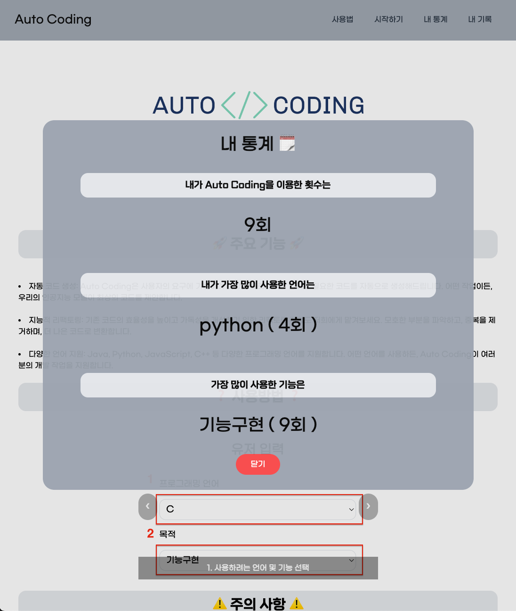
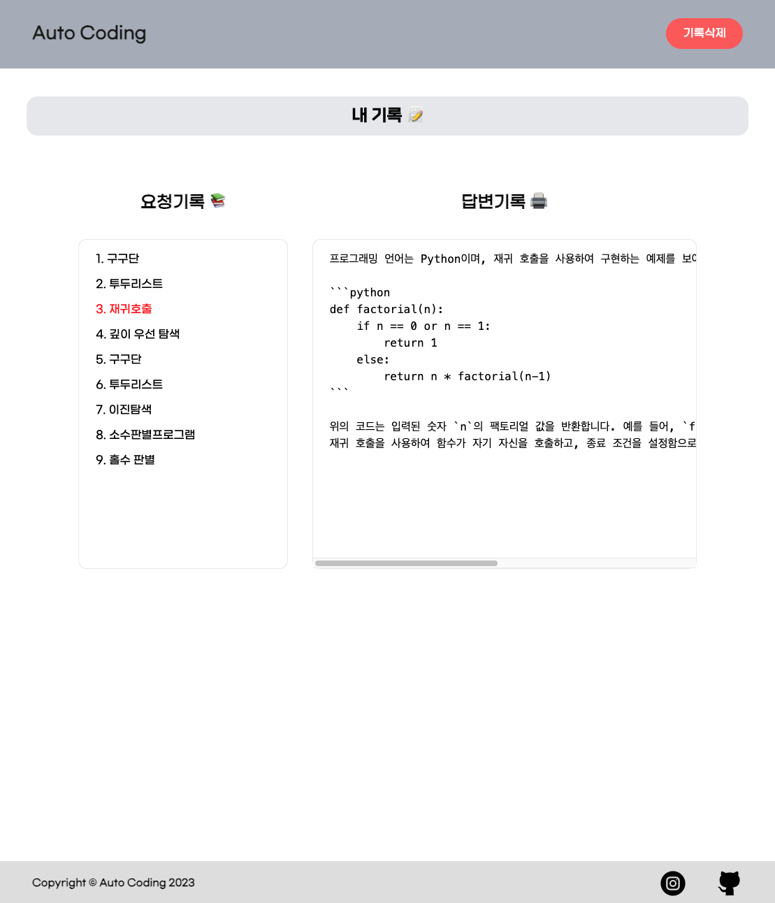
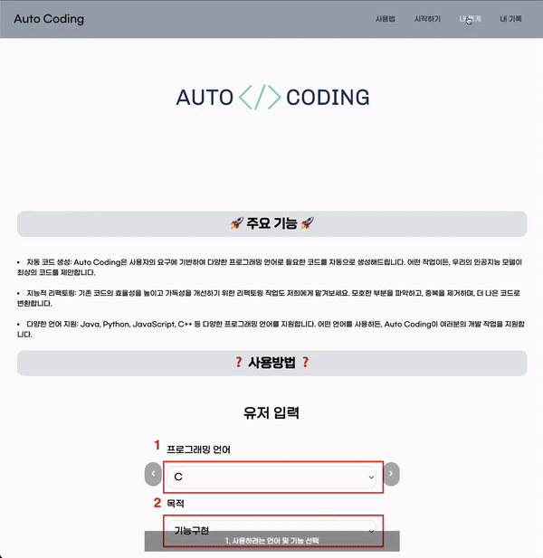
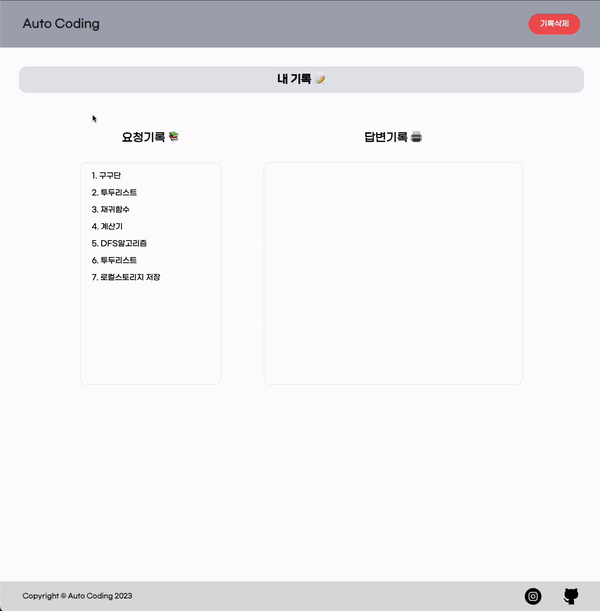

<div align='center'>

# Auto-Coding

</div>
<div align="center">


<!-- [](https://hits.seeyoufarm.com) -->

</div>

## Auto Coding

- 이스트소프트 오르미 3기 백엔드 1차 개인 프로젝트
- 개발기간: 23.08.29 ~ 23.09.06

---

## 목차 📝

1. [프로젝트 소개](#summary)
2. [배포 주소](#url)
3. [프로젝트 일정](#planning)
4. [프로젝트 구조](#tree)
5. [기술 스택](#stack)
6. [화면 구성](#pages)
7. [주요 기능](#main)
8. [주요 기능 동작](#main-exe)
9. [겪었던 오류들](#errors)
10. [추후 계획](#future)
11. [느낀점](#impression)

---

## <span id="summary"> 프로젝트 소개 🙇‍♂️

Auto-Coding은 AI가 코드를 대신 작성해 주는 서비스입니다.

저는 이전에 Chat-GPT를 활용하여 코드 작성에 도움을 받았던 경험이 있었습니다. 그런데 챗봇 시스템을 능숙하게 다루지 못하는 많은 사람들도 기본적인 코드 작성에 도움을 받을 수 있으면 좋겠다고 생각했습니다.

그래서 사용자 친화적이며 직관적인 서비스를 개발하여, 코드 작성에 어려움을 겪는 누구나 손쉽게 도움을 얻을 수 있도록 노력하고 있습니다.

이런 기술력을 활용하여 사용자들은 원하는 프로그래밍 언어와 필요한 기능을 선택하고 세부 내용을 입력함으로써 AI가 작성한 코드를 쉽게 확인할 수 있습니다.

---

## <span id="url">배포 주소 🔗

> **🔗 Github Pages**: <a href="https://hiimyong99.github.io/Auto-Generate-Code/" target="_blank"> https://hiimyong99.github.io/Auto-Generate-Code/ </a>

---

## <span id="planning"> 프로젝트 일정 🗓️


---

## <span id="stack">기술 스택📚

### Environment


### Development


  
  
  

---

## <span id="tree">프로젝트 구조 🌳

```tree
📦
├── README.md
├──📂 asset
│   └── img
│       ├── auto-coding-logo.png
│       ├── card-slide-1.png
│       ├── card-slide-2.png
│       ├── card-slide-3.png
│       ├── card-slide-4.png
│       ├── dev_plan.png
│       ├── favicon.ico
│       ├── github.png
│       ├── instagram.png
│       ├── loading.gif
│       ├── mainFunc.gif
│       ├── mainpage.png
│       ├── mainservice.png
│       ├── myhistory.png
│       └── mymodal.png
├──📂 dist
│   └── output.css
├── index.html
├── package-lock.json
├── package.json
├──📂 pages
│   └── myhistroy.html
├──📂 src
│   └── js
│       ├── app.js : 메인 서비스 (서버와의 통신)
│       ├── data.js : API에게 사전 지식 주입
│       ├── local-storage.js : 언어, 목적, 세부내용 로컬스토리지 관리
│       ├── myhistory.js : 내 기록 페이지 작성
│       ├── mypage.js : 내 통계 페이지 작성
│       ├── navbar.js : 반응형 메뉴 토글 컴포넌트
│       └── sliders.js : card-slider 컴포넌트
└── tailwind.config.js
```

---

## <span id="pages">화면 구성 📺

|                    메인 페이지                    |                     메인 서비스                      |
| :-----------------------------------------------: | :--------------------------------------------------: |
|  |  |
|                      내 통계                      |                    내 기록 페이지                    |
|   |    |

---

## <span id="main">주요 기능 💻

### ⭐️ 자동 코드 생성

- AI가 사용자의 요청을 기반으로 코드를 자동으로 생성합니다.

### ⭐️ 내 통게

- 사용자가 서비스를 이용한 횟수, 가장 자주 사용한 언어와 기능을 확인할 수 있습니다.

### ⭐️ 내 기록

- 이전에 요청한 내용과 AI의 답변을 간편하게 조회할 수 있습니다. 코드와 대화가 모두 기록됩니다.

---

## <span id="main-exe">주요 기능 동작 🚨

|       메인 서비스(자동 코드 생성)       |
| :-------------------------------------: |
|  |

- 사용자가 선택한 option과 입력한 세부내용들을 요청버튼을 클릭하여 AI에게 데이터를 요청합니다.

- AI에게 응답 받은 내용을 html 문서에 출력합니다.
  <br><br>

|                내 통계                 |
| :------------------------------------: |
|  |

- 메인 페이지를 벗어나지 않고 모달 창을 이용하여 편리하게 사용자의 통계를 확인할 수 있습니다.

- 위 통계는 사용자가 AI에게 요청할 때 입력한 내용들이 로컬스토리지에 저장되어 관리되었습니다.

  <br><br>

|                 내 기록                 |
| :-------------------------------------: |
|  |

- 이전에 AI에게 요청했던 세부내용들과 AI에게 답변 받은 내용들은 '내 기록' 페이지에서 언제든지 확인할 수 있습니다.

- 혹시라도 기록을 삭제하고 싶다면 기록삭제 버튼을 클릭하여 초기화 시킬 수 있습니다.

- 위 기록또한 사용자가 AI에게 요청할 때 입력한 내용과 AI가 답변할 때 로컬스토리지에 저장되어 관리되었습니다.

  <br>

---

## <span id="errors">겪었던 오류들 😑

- 이번 프로젝트를 진행하며 겪었던 오류들은 노션에 따로 정리 했습니다.


> **🔗 Errors**: <a href="https://www.notion.so/c6755304ce754d88a421a03cab44d8d9?pvs=4" target="_blank">노션 링크 </a> <br>

## <span id = "future">추후 계획 🌅

- JS 모듈화를 통해 유지보수 및 성능 측면 개선 예정입니다.

- 모바일에서의 최적화 작업을 통해 모바일 환경에서도 문제 없이 서비스를 사용할 수 있도록 할 예정입니다.

## <span id="impression">느낀점 🧑‍💻

- 이번 프로젝트를 통해 기획단계의 중요성을 몸소 깨달을 수 있었습니다. 프로젝트를 진행할 때 카카오 오븐을 이용하여 프로토 타입을 제작하기 했지만 기초적인 UI만을 그리고 바로 개발단계에 도입하였는데 개발 도중 UI를 수정하는 일이 빈번해져 프로젝트 진행 하는데 어려움을 겪었습니다. 이후의 프로젝트에서는 좀 더 구체적이고 체계적인 기획 단계를 거쳐 효율적으로 진행할 계획입니다.

- 항상 혼자 개발 공부를 시작하면 프로젝트의 끝을 본 적이 없고 흐지부지 마무리됐었는데 이번에 처음으로 프로젝트를 완성하면서 부족한 점을 확인 할 수 있었습니다. 다음 프로젝트에는 이 부분들을 보완하여 보다 완성도 있는 코드와 결과물을 만들고 싶다는 욕심이 생겼습니다.

---
