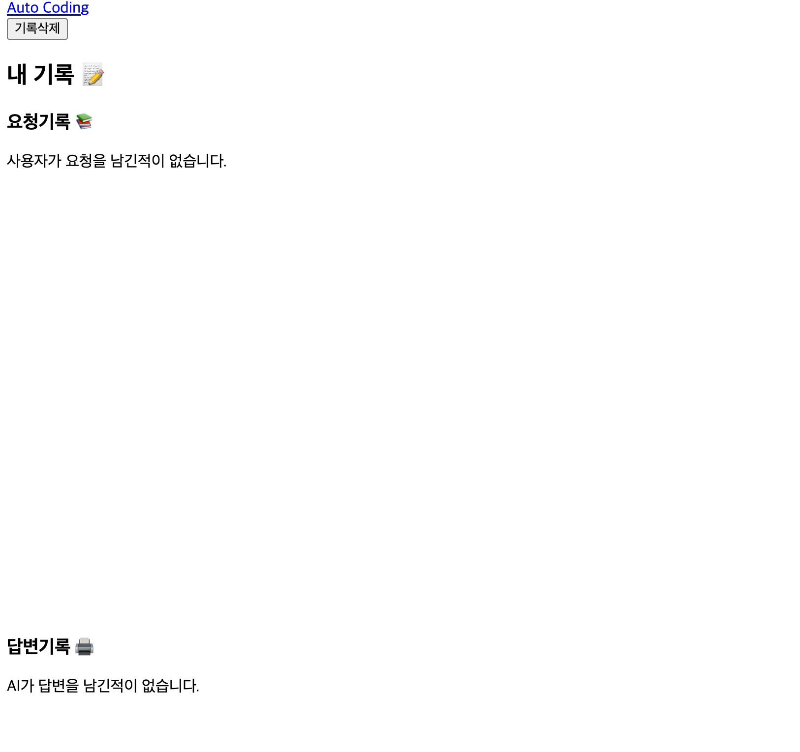

# GitHub Page에서만 이미지가 안 뜰 때!

## 에러내용

- 로컬 환경에서는 잘 적용 되던 이미지 or 페이지 이동 or CSS가 GitHub Page에서 적용이 되지 않음
  

  ***

## 해결 방법

- 경로 설정에서 잘못됨

- 경로 맨 앞에 "/"를 붙일경우 절대 경로, 프로젝트의 가장 높은 경로를 가리키게 된다

ex)

```html
href="/../index.html"
```

수정 후

```html
href="../../index.html"
```

- 다음과 같이 상대경로를 사용하여 해결해야 한다.

`/ ` == root 폴더

`./ ` == 현재폴더

`../` ==  상위폴더


> ### 이번과 같이 css가 적용이 되지 않거나 사진이 표시되지 않는다면 경로부터 확인해보자